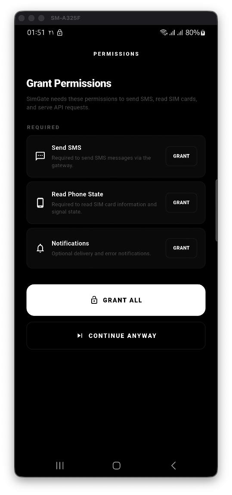
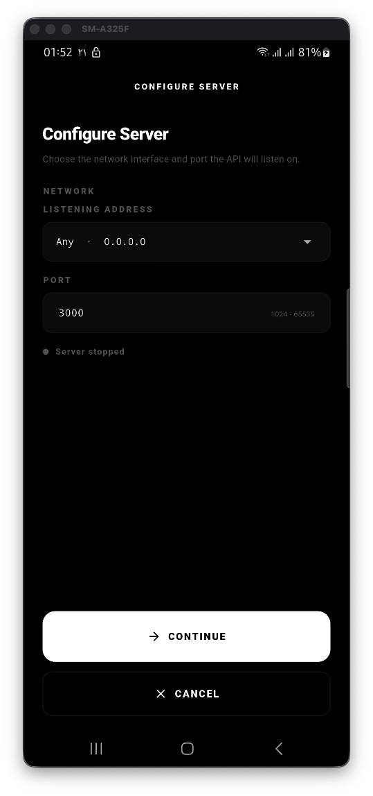
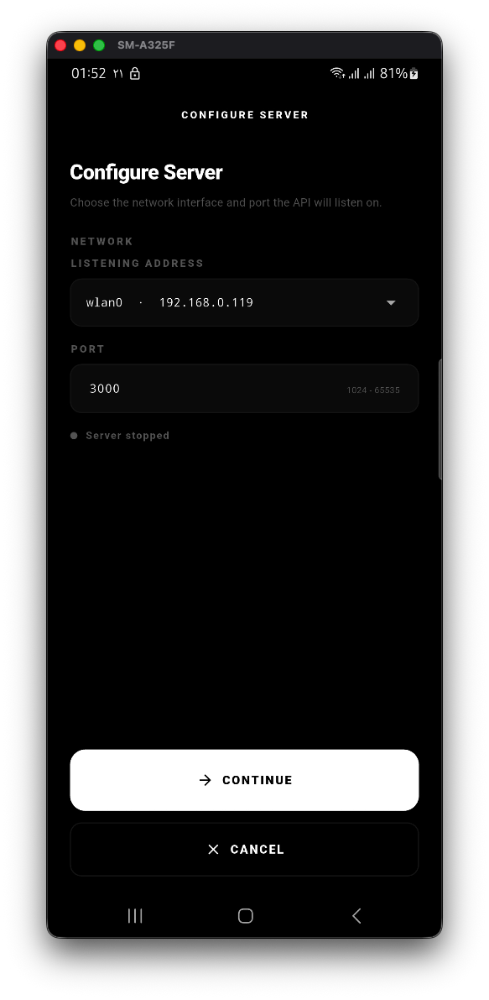
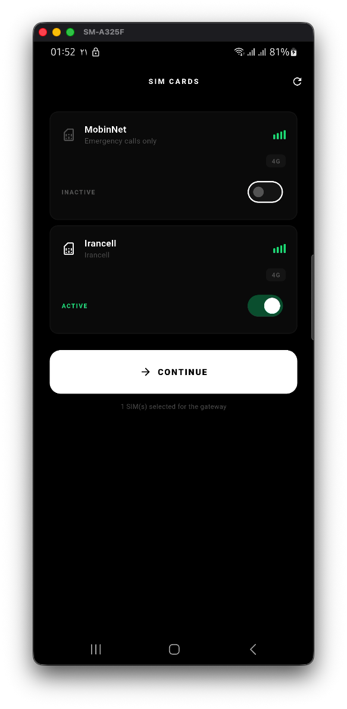
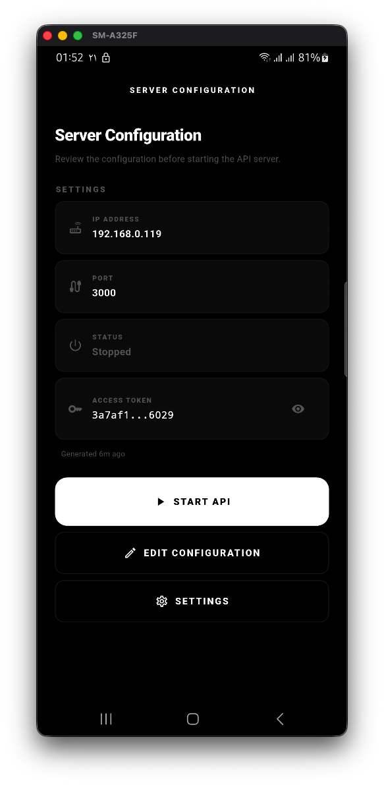
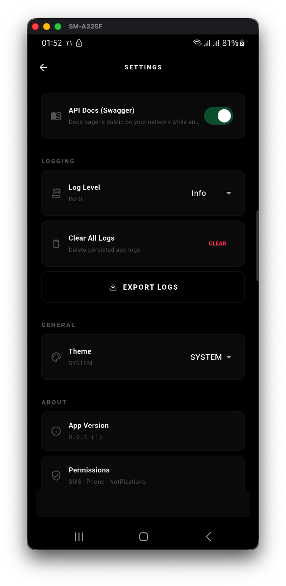
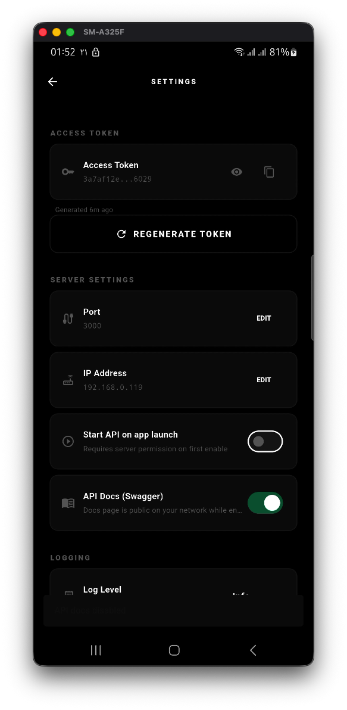
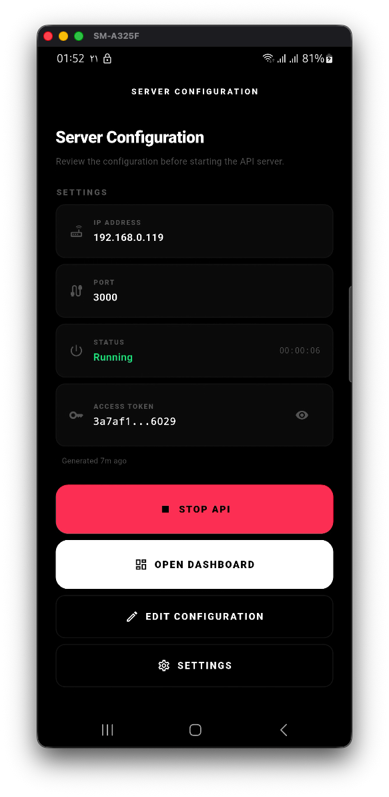
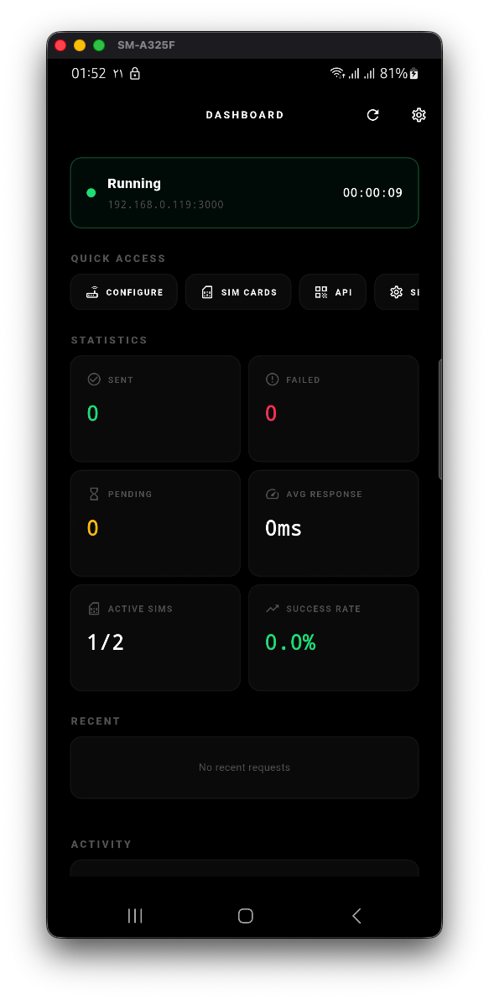
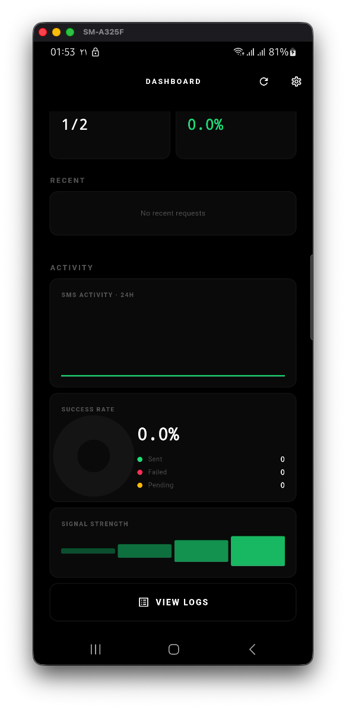

# SimGate

Self-hosted SMS API Android app. Turns any Android device into a small SMS gateway:
send and manage text messages over a local HTTP API, one app — no carrier services.

## Screenshots

| Grant Permissions | Configure Server (Any) |
| --- | --- |
|  |  |

| Configure Server (WiFi) | SIM Card Selection |
| --- | --- |
|  |  |

| Server Configuration (Stopped) | Settings |
| --- | --- |
|  |  |

| Settings - Token & Server | Server Configuration (Running) |
| --- | --- |
|  |  |

| Dashboard Overview | Dashboard - SMS Activity & Stats |
| --- | --- |
|  |  |

## Features

- Embedded HTTP server (shelf) with bearer-token auth and CORS
- Multi-SIM support: detect, activate/deactivate, send via a specific SIM
- Persistent queue with retry/backoff for failed sends
- QR code with the API URL + token for quick client setup
- Built-in Swagger UI docs (`/swagger.html`, gated by a settings toggle)
- Configurable port, IP binding, and log retention (all in-app)
- Server info, request logs, and SMS history (filterable)
- Material dark UI: permissions → server setup → SIM selection → confirm → API endpoint (QR) → dashboard hub (logs, settings)

## Architecture

```
lib/
  constants/   API paths + app-wide constants
  config/      DI container (get_it), theme
  database/    sqflite schema (migrations/) + queries/
  models/      domain models
  repositories/  data access (sms, sim, logs, config)
  services/    business logic (sms send/retry, sims, tokens, platform channel)
  server/      HTTP server, handlers/, middleware/, swagger/
  providers/   ChangeNotifier state for pages
  pages/       UI screens (permissions, setup, sims, config, api endpoint,
               dashboard, logs, settings)
  widgets/     shared widgets
  utils/       helpers, validators, logging
android/app/src/main/kotlin/com/example/sim_gate/
  MainActivity.kt      app entry
  SimGateChannels.kt   platform channel: sendSms, detectSims, networkInterfaces
```

## Getting started

Requirements: Flutter (stable) + an Android device/emulator with a SIM (or `adb`).

```bash
flutter pub get
flutter run          # pick your device
```

## API

Base URL: `http://<device-ip>:<port>/api` — shown as a QR code in the app.
`GET /health` and the Swagger docs (`/swagger.html`, `/swagger.json`, gated by a
settings toggle) are public; all other endpoints require
`Authorization: Bearer <token>`.

| Method | Path                 | Description                     |
| ------ | -------------------- | ------------------------------- |
| GET    | `/health`            | Liveness check                  |
| GET    | `/swagger.html`      | Swagger UI docs (if enabled)    |
| GET    | `/swagger.json`      | OpenAPI spec (if enabled)       |
| POST   | `/sms/send`          | Queue an SMS: `{recipient, message, simId?}` |
| POST   | `/sms/cancel`        | Cancel a queued message         |
| GET    | `/sms/status`        | SMS request status              |
| GET    | `/sms/logs`          | SMS history                     |
| GET    | `/sims/active`       | Active SIMs                     |
| POST   | `/sims/activate`     | Activate a SIM                  |
| GET    | `/server/info`       | Uptime, IP, port, SIMs          |
| GET    | `/server/token`      | Current token                   |
| POST   | `/token/regenerate`  | Rotate the token                |
| PUT    | `/config/ip`         | Change bind IP                  |
| PUT    | `/config/port`       | Change bind port                |
| PUT    | `/logs/retention`    | Log retention days              |

## Testing

```bash
flutter analyze       # static analysis
flutter test          # unit + widget tests
./scripts/test.sh     # analyze + full test suite
./scripts/check.sh    # full project check (analyze, tests, build)
```

## Scripts

| Script               | Purpose                                  |
| -------------------- | ---------------------------------------- |
| `scripts/test.sh`    | Analyze + unit/widget tests              |
| `scripts/check.sh`   | Full check: analyze, tests, APK build    |
| `scripts/dev.sh`     | Run the app on a connected device        |
